### CLI Tool Test

The aim of this test is trying to stimulate the user experience, and compare actual results with excepted results.

#### Test Cases

We set some cases for each function, and compare actual results with excepted results.

Case1: new user signup
  - Step:
    -  1. Start system, it will show a welcome page
    -  2. Type “signup” add “username”  
    -  3. Type  a new password
  - Excepted results: 
    - The system shows ”Signup success, Please login to continue”.
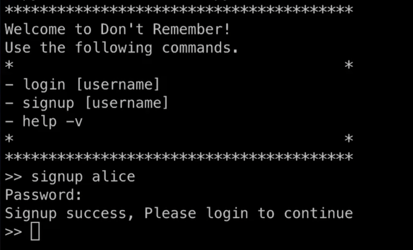

Case2: user login
  - Premise: 
    - Need to finish case 1
  - Step:
    - 1. Type “login” add “username” (username need to change)
    - 2. Type password
  - Excepted results 
    - Branch 1: type the correct password, shows “Login success”.
    - Branch 2: if the username or password is incorrect, shows error.
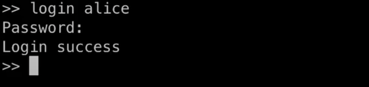

Case 3: add words
  - Premise: 
    - Login success.
  - Step:
    - Type “add” “word” (word need to change)
  - Excepted results:
    - Branch1: Shows “Add word success”.
    - Branch2: shows error, if the word is not exist
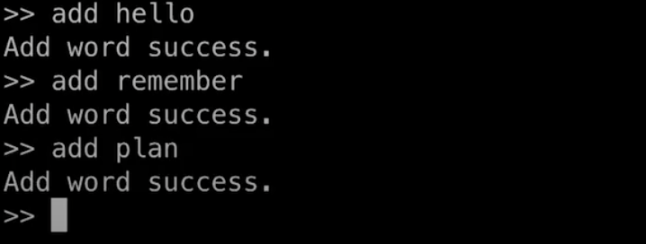

Case 4: study word
  - Premise: 
    - Login success, words added.
  - Step:
    - Type “nextword”
  - Excepted results:
    - Shows a word and its explanation
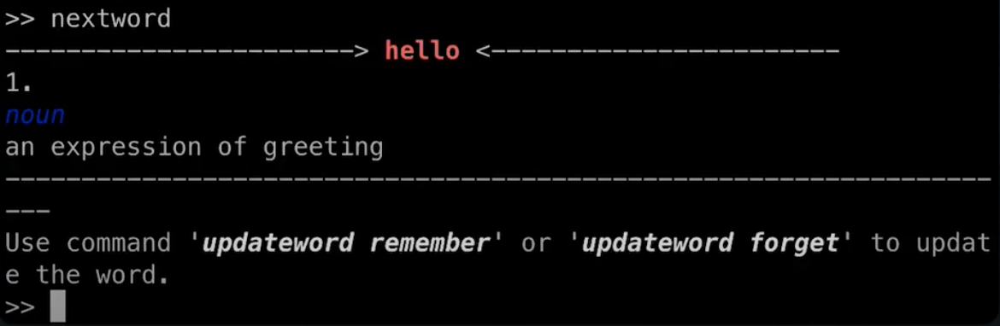

Case 5: remember/forget word
  - Premise: 
    - Login success, case 4 finished.
  - Step:
    - Type “updateword remember” or “updateword forget”
  - Excepted results:
    - Shows “Update word success”
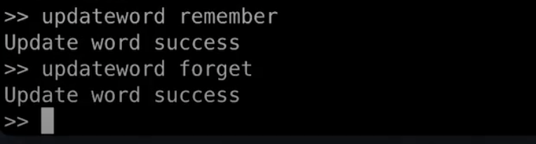

Case 6: view history
  - Premise:
    - Login success, case 5 finished.
  - Step:
    - Type “learninghistory”
  - Excepted results:
    - Shows user’s study history and plan

Case 7: view personal progress
  - Premise:
    - Login success.
  - Step:
    - Type “personalprogress”
  - Excepted results:
    - Shows user’s study progress. (the default plan is 20 words)
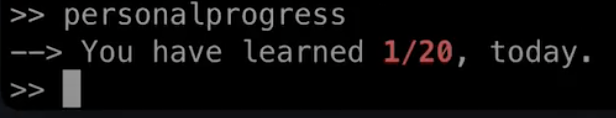

Case 8: change personal study plan
  - Premise: 
    - Login success
  - Step:
    - Type ”changeplan” add “number”
  - Excepted results:
    - Shows “Set plan success”. Repeat the case7, it will show new study plan
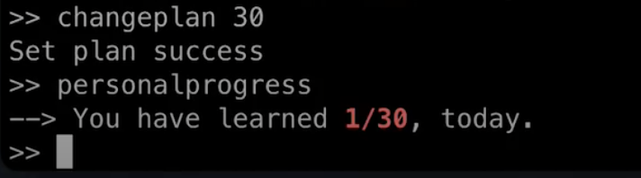

Case 9: delete words
  - Premise:
    - Login success, words added.
  - Step:
    - Type “deleteword” add “word” (word need to change)
  - Excepted results:
    - Branch1: Shows “Delete word success”, repeat case6, the deleted word will not show.
    - Branch2: Shows error, if the word is not exist.
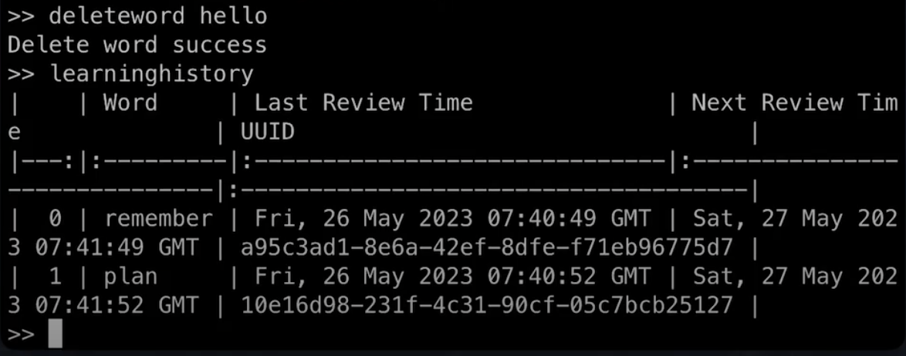

Case 10: Create a new team
  - Premise: 
    - Login success
  - Step:
    - Type “newteam” add “team name”  (team name need to change)
  - Excepted results:
    - Shows “Create new team success”
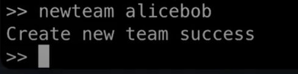

Case 11: view your team
  - Premise: 
    - Login success, case 10 finished
  - Step:
    - Type “”teaminfo
  - Excepted results:
    - Shows “Team Name”, ”Team UUID”, ”Plan” and “Member Info”
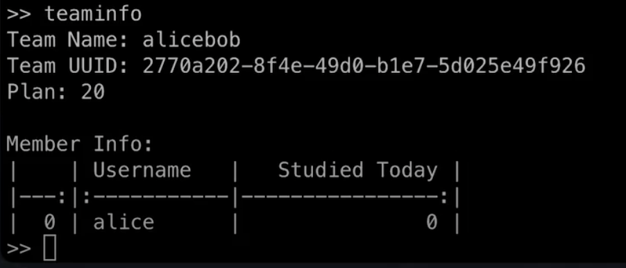

Case 12: join a team
  - Premise: 
    - another user finished case2. 
  - Step:
    - 1. Get the team uuid from your team member
    - 2. Type “addteam” add “team uuid” (team uuid need to change)
  - Excepted results:
    - Branch1: Shows “Add team success” repeat case10, it will show new team info.
    - Branch 2: Shows error, if the team uuid is incorrect.
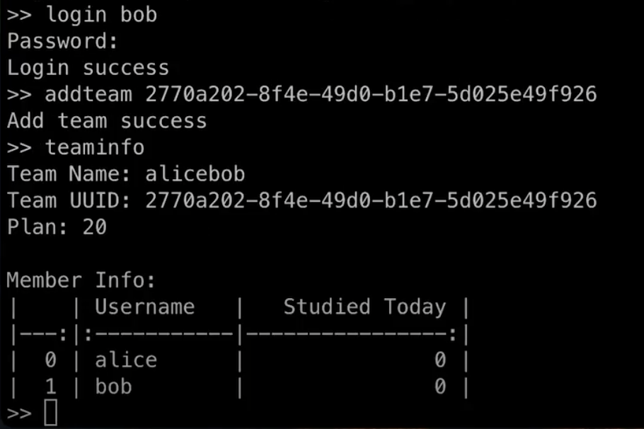

Case 13: leave a team
  - Premise: 
    - Login success,joined a team
  - Step:
    - Type “leaveteam” add “team uuid” (team uuid need to change)
  - Excepted results:
    - Shows “Leave team success”, repeat case 10, user will not show in team info.
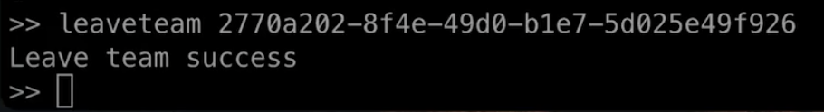

Case 14: update team’s study plan
  - Premise:
    - Login success, team joined.
  - Step:
    - Type ”changeteamplan” add “team uuid” add ”number” (team uuid and number need to change)
  - Excepted results:
    - Shows ”Set plan success”, repeat case 10, the team study plan has changed
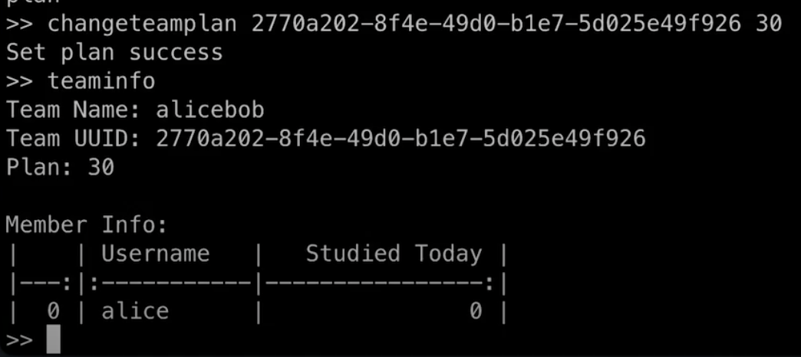

Case 15: logout
  - Premise:
    - Login success
  - Step:
    - Type “logout”
  - Excepted results:
    - Shows “Logout success”, return to welcome page
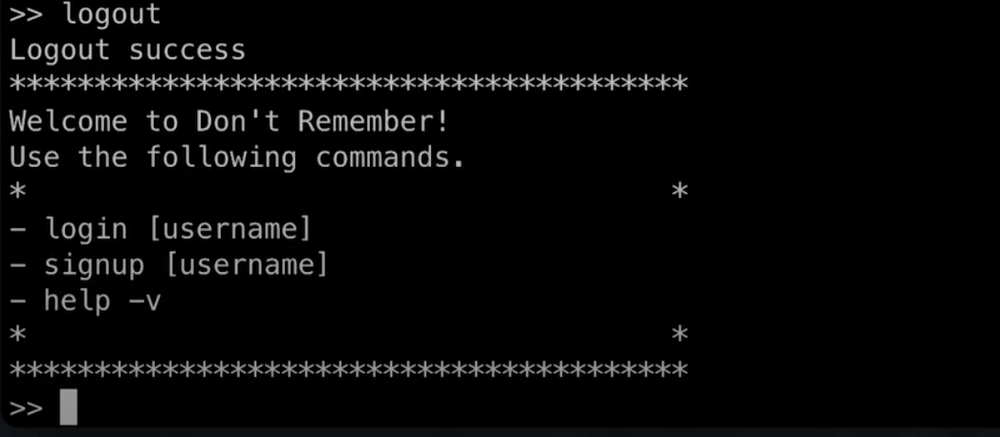
