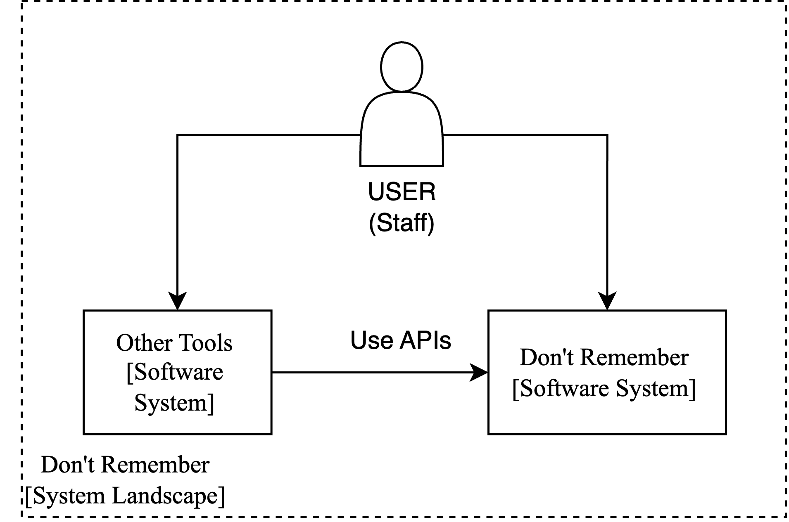
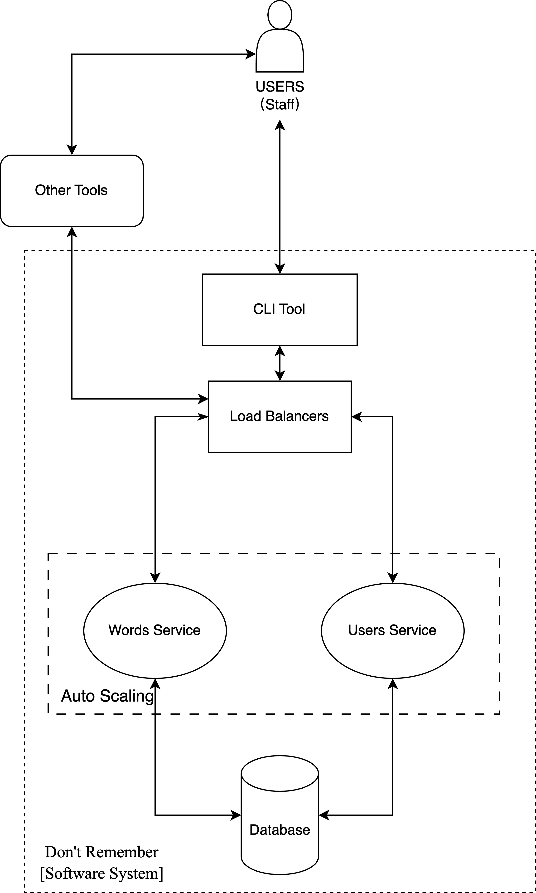
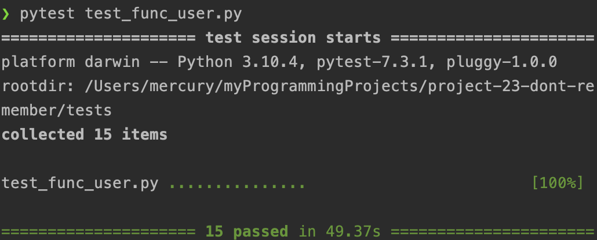
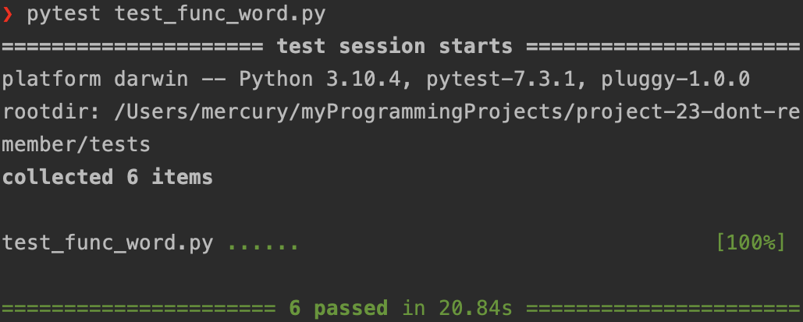

# Don't Remember

[Original Proposal](https://csse6400.github.io/project-proposal-2023/s4786694/proposal.html)

## Abstract

## Proposal Clarification

- This section is used to explain some of the unclear content described in the proposal.
- In the [proposal scope](https://csse6400.github.io/project-proposal-2023/s4786694/proposal.html#scope), it says
  _User preference, including change the level of English study._ In here, The _change the level of English study_ means
  two functions: 1. Users should know the study progress of each day. 2. The system should automatically choose the word
  that user need to learn each day.
- In the [proposal scope](https://csse6400.github.io/project-proposal-2023/s4786694/proposal.html#scope), it says
  _dynamically change the studying plan_. It means the same as the _change the level of English study_ in the proposal.
  which is that the system should automatically choose the word that user need to learn each day.
- In the following sections, we will use _study plan_ or _plan_ to indicate the number of words a user set to learn each
  day.

## Changes

- In the proposal, it says _choose the vocabulary book(example: IELTS,Oxford)_. For the copyright constraint, we
  selected
  an opensource dictionary [WordSet](https://github.com/wordset/wordset-dictionary) as our dictionary.
- In the proposal, it says:

> when user have a period of time without using this software to study, it will decrease the new daily words and show
> more learned words to review. And if user learn new words quickly in recent days, it will increase the difficulty and
> show more new words in the future study.

There is no scientific way found to determine the difficulty of a word, we decided to allow users to add their own word,
they can also delete word if they want.

## Scope

The MVP should be able to:

- Basic Functionality
    - Signup/Login/Logout
- Word Learning
    - Add/Delete word they want to learn/
    - Update word status (choose "remember" or "forget" a word)
    - Show personal progress
    - Set personal plan
    - Show word learning history
- Team Learning
    - Build new team/Add me to a team/leave a team
    - Set team plan
    - Check team information (including team members, team progress, team plan).

## Architecture

The architecure is a Service-based Architecture

### System Landscape

In Figure x, we observe two distinct software systems and one role represented within the system landscape of Don't
Remember, which also includes users, other tools, and Don't Remember. As Don't Remember is a business-to-business (ToB)
project, the _user_ role primarily symbolizes staff members.

The _Other Tools_ software system embodies a suite of compliant and personalized software integrated within the
company's server infrastructure. Staff can utilize these tools to interact with the Don't Remember software system.
Alternatively, they can also use a built-in Command Line Interface (CLI) within Don't Remember to communicate with the
system. However, it's worth noting that this CLI is primarily intended for demo purposes; therefore, we generally advise
against its regular use.

Lastly, the _Other Tools_ system interfaces with the Don't Remember system through a set of dedicated APIs. As such, a
streamlined interaction is established, further facilitating user engagement.

### Don't Remember Software System

Our software system provides a CLI tool for demonstration purposes. User requests can originate from this CLI tool or
other tools. Initially, these requests reach the Amazon Elastic Load Balancers. Subsequently, these requests are
redirected to the auto-scaling group that hosts two microservices: the Users Microservice and the Words Microservice.
Both services can directly communicate with the database.

#### Load Balancers

The load balancers use two rules to manage traffic:

- Requests directed to `/api/v1/users/*` or `/api/v1/users` are forwarded to the Words Microservice.
- Requests directed to `/api/v1/words/*` or `/api/v1/words` are forwarded to the Users Microservice.

#### Services

The Users Microservice and Words Microservice are hosted on AWS ECS, with auto-scaling policies in place.
The Users Microservice handles user and team-related requests, specifically:

- Add/Delete word they want to learn
- Update word status (choose "remember" or "forget" a word)
- Show personal progress
- Set personal plan
- Show word learning history

On the other hand, the Words Microservice handles word-related tasks:

- signup/login/logout
- Build new team/Add me to a team/leave a team
- Set team plan
- Check team information (including team members, team progress, team plan).

#### Database

We use a Postgres database to store all the data. This includes user information, user's learning
word records, learning history, team information, and team members and so on.

#### CLI tool

A Python-based CLI tool is available for demonstration purposes. It encompasses all the functionalities mentioned within
the scope.

## Trade-Offs

### Three Token Verification Strategies: Redis, PostgreSQL, and JWT

Initially, we introduced tokens for security purposes. Each user is assigned a token with a set expiration time upon
login. Below, we outline three different strategies for token verification:

The first strategy involves storing tokens in Redis. This approach is advantageous due to its speed and the benefit of
having a separate service, simplifying maintenance. However, for a minimum viable product (MVP), this strategy is likely
too costly in terms of development.

Consequently, the second strategy is to store tokens in a PostgreSQL database. Compared to Redis, this is a more
cost-effective solution, and its speed suffices for the MVP. Nonetheless, it does present a potential security risk in
the event of a database leak.

The final strategy utilizes JSON Web Tokens (JWT) to automatically generate tokens. These tokens don't require storage
and are encapsulated in the HTTP request headers. This approach is not only more secure but also less
development-intensive than the previous two methods. However, it comes with a functional drawback: it does not support
server-side logout.

In consideration of speed, development cost, security, and functionality, we have ultimately decided to use JSON Web
Tokens (JWT) for token generation and verification, despite its inability to support server-side logout.

### Choosing the Optimal Database Strategy for MVP Development

In terms of database design, we considered two different strategies.

The first strategy involved using a hybrid approach: storing the user table in PostgreSQL, and the wordslist and
Dictionary tables in Amazon DocumentDB. Owing to its NoSQL nature, Amazon DocumentDB provides stable, low-latency read
and write performance, which is superior compared to relational databases like PostgreSQL. However, this approach poses
significant challenges for our MVP development: the cost of utilizing Amazon DocumentDB is high, and the execution of
joint queries with User data stored in PostgreSQL can be complicated.

The alternative strategy was to store all tables in PostgreSQL. This option offers a more cost-effective solution that
aligns well with the budget constraints of our MVP development. Given these considerations, we've decided to adopt this
second strategy, consolidating all our tables within a single PostgreSQL database.

### Deciding Between Separate or Combined Microservices for Team and User Functions

Should Team and User function be seperated into two microservices?

- Separate Team and User as Two Microservices
    - Pros:
        - Easy to development, each microservice only need to handle one type of request.
    - Cons:
        - Developing two microservices will increase development costs.
        - Our current database has a capacity of 300 connections; separating them will establish more connections when
          scaling out, necessitating a database upgrade.
        - Need a method a figure how to communicate between Team and User, because they are highly related.
- Put Team and User in the Same Microservices
    - Pros:
        - Lower development and deployment cost.
        - Easier communication between Team and User.
        - The current database capacity of 300 connections is sufficient.
    - Cons:
        - Potential deployment waste, since requests to users are more frequent than requests to teams.
          Considered this is a MVP, we decided to put Team and User in the same microservice.

## Critique

## Evaluation

### Functionality

The following screenshots shows the functionality test of the system, the test result is conducted on the deployed
environment on AWS.

From the test results, we can see that all the functionalities are working as expected.

### Security Tests

To address security concerns, we have implemented access control for user data. To use the functionality users must
generate a token with the /login endpoint of the users API. We have created a suite of automated tests to test if the
tokens can provide all information of a user, and if user's data is protected by the token.

### Functionality Tests

#### Test Plan

Test every functionality of the system, which includes all the functionalities mentioned in the scope. We think up every
possible use case and write tests to cover them. The tests are first conducted in our local development environment, and
then they are tested after being deployed on AWS.

#### Test Link

- [Users Test](../tests/users_test.py)
- [Words Test](../tests/words_test.py)

#### How to Run the Code

1. Change the URl of endpoints in base.py
2. Use command `pytest`

### Availability Tests

The following tests aim to determine the longevity of the service. Due to time limitation, we test whether our
application can run for a full day.

### Maintainability Tests

To support the future of our application, we try to test if our architecture can hold up for future test cases. One case
is database migrations, where we have implemented functionality for this, incase we want to configure out databases in
the future.

### Scalability Tests

We test how our architecture handles high loads.

## Reflections
