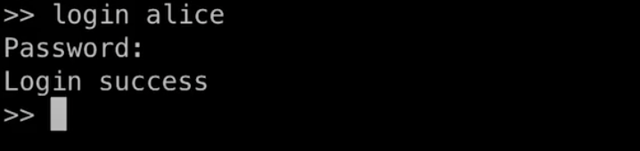
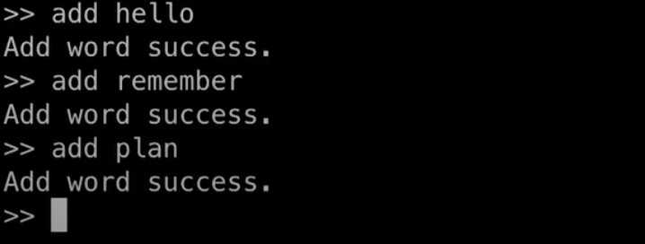
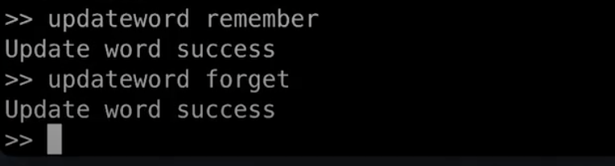
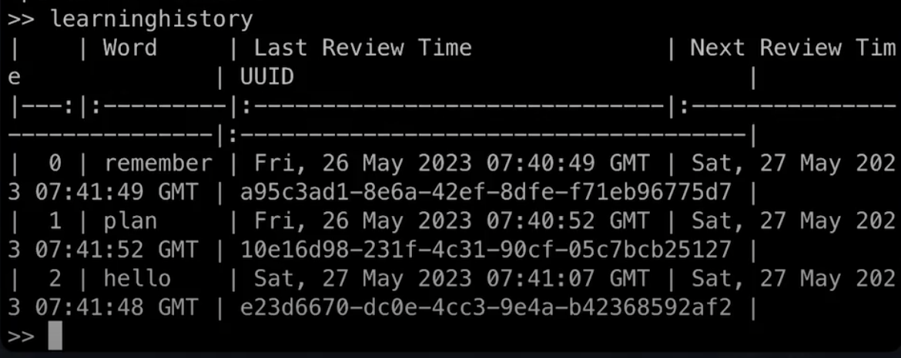
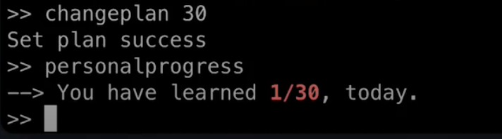
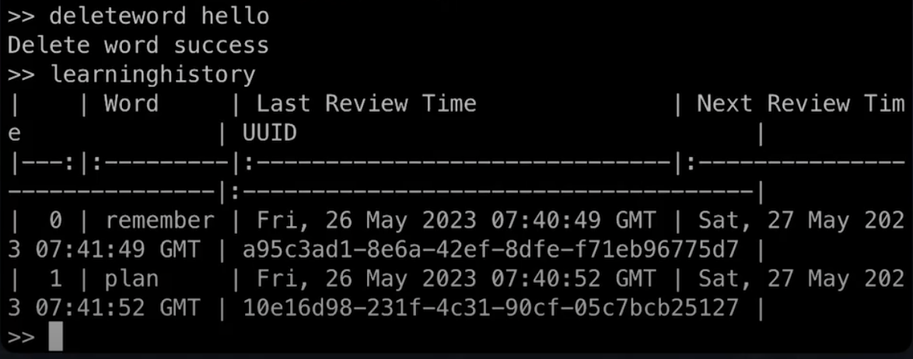
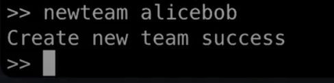
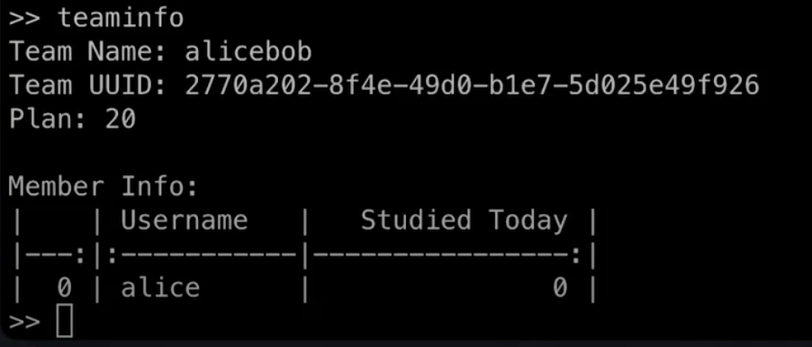
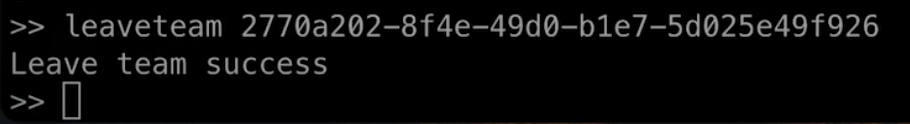
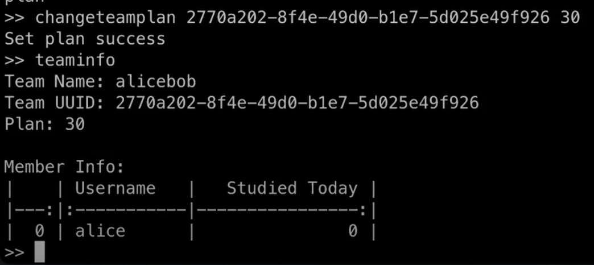

# Don't Remember

[Original Proposal](https://csse6400.github.io/project-proposal-2023/s4786694/proposal.html)

## Abstract

## Proposal Clarification

- This section is used to explain some of the unclear content described in the proposal.
- In the [proposal scope](https://csse6400.github.io/project-proposal-2023/s4786694/proposal.html#scope), it says
  _User preference, including change the level of English study._ In here, The _change the level of English study_ means
  two functions: 1. Users should know the study progress of each day. 2. The system should automatically choose the word
  that user need to learn each day.
- In the [proposal scope](https://csse6400.github.io/project-proposal-2023/s4786694/proposal.html#scope), it says
  _dynamically change the studying plan_. It means the same as the _change the level of English study_ in the proposal.
  which is that the system should automatically choose the word that user need to learn each day.
- In the following sections, we will use _study plan_ or _plan_ to indicate the number of words a user set to learn each
  day.

## Changes

- In the proposal, it says _choose the vocabulary book(example: IELTS,Oxford)_. For the copyright constraint, we
  selected
  an opensource dictionary [WordSet](https://github.com/wordset/wordset-dictionary) as our dictionary.
- In the proposal, it says:

> when user have a period of time without using this software to study, it will decrease the new daily words and show
> more learned words to review. And if user learn new words quickly in recent days, it will increase the difficulty and
> show more new words in the future study.

There is no scientific way found to determine the difficulty of a word, we decided to allow users to add their own word,
they can also delete word if they want.

## Scope

The MVP should be able to:

- Basic Functionality
    - Signup/Login/Logout
- Word Learning
    - Add/Delete word they want to learn/
    - Update word status (choose "remember" or "forget" a word)
    - Show personal progress
    - Set personal plan
    - Show word learning history
- Team Learning
    - Build new team/Add me to a team/leave a team
    - Set team plan
    - Check team information (including team members, team progress, team plan).

## Architecture

### System Landscape

In the diagram above, we observe two distinct software systems and one role represented within the system landscape of Don't
Remember, which also includes users, other tools, and Don't Remember. As Don't Remember is a business-to-business (ToB)
project, the _user_ role primarily symbolizes staff members.

The _Other Tools_ software system embodies a suite of compliant and personalized software integrated within the
company's server infrastructure. Staff can utilize these tools to interact with the Don't Remember software system.
Alternatively, they can also use a built-in Command Line Interface (CLI) within Don't Remember to communicate with the
system. However, it's worth noting that this CLI is primarily intended for demo purposes; therefore, we generally advise
against its regular use.

Lastly, the _Other Tools_ system interfaces with the Don't Remember system through a set of dedicated APIs. As such, a
streamlined interaction is established, further facilitating user engagement.

### Don't Remember Software System

Our software system provides a CLI tool for demonstration purposes. User requests can originate from this CLI tool or
other tools. Initially, these requests reach the Amazon Elastic Load Balancers. Subsequently, these requests are
redirected to the auto-scaling group that hosts two microservices: the Users Microservice and the Words Microservice.
Both services can directly communicate with the database.

#### Load Balancers

The load balancers use two rules to manage traffic:

- Requests directed to `/api/v1/users/*` or `/api/v1/users` are forwarded to the Words Microservice.
- Requests directed to `/api/v1/words/*` or `/api/v1/words` are forwarded to the Users Microservice.

#### Services

The Users Microservice and Words Microservice are hosted on AWS ECS, with auto-scaling policies in place. Each Service
is using Flask as the web framework, gunicorn as the WSGI server. And each service is stateless, all the stateful data
is
stored in the database.

The Users Microservice handles user and team-related requests, specifically:

- Add/Delete word they want to learn
- Update word status (choose "remember" or "forget" a word)
- Show personal progress
- Set personal plan
- Show word learning history

On the other hand, the Words Microservice handles word-related tasks:

- signup/login/logout
- Build new team/Add me to a team/leave a team
- Set team plan
- Check team information (including team members, team progress, team plan).

#### Database

We use a Postgres database to store all the data. This includes user information, user's learning
word records, learning history, team information, and team members and so on.

#### CLI tool

A Python-based CLI tool is available for demonstration purposes. It encompasses all the functionalities mentioned within
the scope.

### How does it achieve Quality Attributes?

#### Security

In the "Don't Remember" project, we enhance security through the use of Tokens and JWT. Tokens serve as proof of
identity and authorization; users carry them in their subsequent requests, and our servers validate these Tokens to
confirm identities. Furthermore, JWT, with its self-contained nature, contains all necessary information, reducing the
need for constant database queries. This design enables secure and efficient identity verification, authorization, and
cross-domain authentication, all while significantly bolstering the system's security.

#### Reliability

Our architectural design is fault-tolerant, for the reason that firstly, we use AWS ECS to host our services, which
provides auto-scaling policies, when requests increases, the ECS will scale up to make sure the system caused no time
out fault. Secondly, there is a health endpoint in each service, the load balancer will check the health of each
service,
if one service is down, the load balancer will redirect or start a new service.

#### Availability

- An auto-scaling policies are in place to ensure the availability of the system. When the number of requests increases,
  the ECS will scale out to make sure the system is always available.
- Similar to Reliability, there is a health endpoint in each service, the load balancer will check the health of each
  one, if fails, new service will be started.

#### Maintainability

Terraform is used to manage the infrastructure, which makes it easy to maintain and update. ECS is used, when update, we
only need to update the docker image, and the ECS will automatically update the service.

#### Scalability

- AWS ECS is used with auto-scaling policies.
- Microservices architecture is used, when requests to one microservice are increased, it can be scaled easily.

#### Extensibility

In the "Don't Remember" project, scalability is predominantly showcased through our use of a microservices architecture.
Leveraging the inherent decoupling characteristics of this architecture, we can add new functionalities by simply
creating a new microservice. Additionally, we provide well-defined and decoupled endpoints, making it convenient for
future developers to build new features based on this foundation. Moreover, the employment of JWT alleviates server
load, freeing up more resources for potential service expansion.

## Trade-Offs

### Three Token Verification Strategies: Redis, PostgreSQL, and JWT

Initially, we introduced tokens for security purposes. Each user is assigned a token with a set expiration time upon
login. Below, we outline three different strategies for token verification:

The first strategy involves storing tokens in Redis. This approach is advantageous due to its speed and the benefit of
having a separate service, simplifying maintenance. However, for a minimum viable product (MVP), this strategy is likely
too costly in terms of development.

Consequently, the second strategy is to store tokens in a PostgreSQL database. Compared to Redis, this is a more
cost-effective solution, and its speed suffices for the MVP. Nonetheless, it does present a potential security risk in
the event of a database leak.

The final strategy utilizes JSON Web Tokens (JWT) to automatically generate tokens. These tokens don't require storage
and are encapsulated in the HTTP request headers. This approach is not only more secure but also less
development-intensive than the previous two methods. However, it comes with a functional drawback: it does not support
server-side logout.

In consideration of speed, development cost, security, and functionality, we have ultimately decided to use JSON Web
Tokens (JWT) for token generation and verification, despite its inability to support server-side logout.

### Choosing the Optimal Database Strategy for MVP Development

In terms of database design, we considered two different strategies.

The first strategy involved using a hybrid approach: storing the user table in PostgreSQL, and the wordslist and
Dictionary tables in Amazon DocumentDB. Owing to its NoSQL nature, Amazon DocumentDB provides stable, low-latency read
and write performance, which is superior compared to relational databases like PostgreSQL. However, this approach poses
significant challenges for our MVP development: the cost of utilizing Amazon DocumentDB is high, and the execution of
joint queries with User data stored in PostgreSQL can be complicated.

The alternative strategy was to store all tables in PostgreSQL. This option offers a more cost-effective solution that
aligns well with the budget constraints of our MVP development. Given these considerations, we've decided to adopt this
second strategy, consolidating all our tables within a single PostgreSQL database.

### Deciding Between Separate or Combined Microservices for Team and User Functions

Should Team and User function be seperated into two microservices?

- Separate Team and User as Two Microservices
    - Pros:
        - Easy to development, each microservice only need to handle one type of request.
    - Cons:
        - Developing two microservices will increase development costs.
        - Our current database has a capacity of 300 connections; separating them will establish more connections when
          scaling out, necessitating a database upgrade.
        - Need a method a figure how to communicate between Team and User, because they are highly related.
- Put Team and User in the Same Microservices
    - Pros:
        - Lower development and deployment cost.
        - Easier communication between Team and User.
        - The current database capacity of 300 connections is sufficient.
    - Cons:
        - Potential deployment waste, since requests to users are more frequent than requests to teams.
          Considered this is a MVP, we decided to put Team and User in the same microservice.

## Critique

### Security

JWT is able to secure the data of the users in the API. All tests currently pass for security, the api is able to
retrieve user information with a token. Without a token no information can be retrieved, as the token is also used to
identify the user making the request. Additionally there is an expiration time on the token, and it is confirmed by the
tests that the user can not use an expired token to retreive information. There are some long term concerns with this
API's JWT implementation. If a account if comprimised in the future, there is no current method to revoke access to any
tokens created by the account. So a malicious user can still retrieve data with a stolen token until it expires. This
will be be balance of the expiration time of the token. It must be set to a time where it will not inconvenience the
user, but also protect them if their account is comprimised.

### Functionality

Well designed and comprehensive unit tests are passed as well as manual tests by CLI tool which shows that the app is
running as expected.

### Scalability

todo

### Extensibility

Microservices and well-designed decoupled API endpoints make the software extensible. Microservices make the system easy
to extend new functions without the impact of previous services. Decoupled API endpoints make the client can customize
the
workflow. Besides, an endpoint `/word_history` endpoint, provide detailed records of the learning, the clients could
utilize
it to do stuff such as draw a user's forget curve.

## Evaluation

### CLI Tool Test

#### Test Plan

The purpose of this test is to recreate user scenarios. This test includes all functions of Don’t Remember, simulations have been conducted for every possible usage scenario of the user, and every step of the user's operation has been simulated in the returned results.

#### Test Workflow&Result

We set some cases for each function, and compare actual results with excepted results.

- Case1: new user signup
Step:
1. Start system, it will show a welcome page
2. Type “signup” add “username”  
3. Type  a new password
Excepted results: 
The system shows ”Signup success, Please login to continue”.

 
- Case2: user login
Premise: 
Need to finish case 1
Step:
1. Type “login” add “username” (username need to change)
2. Type password
Excepted results 
Branch 1: type the correct password, shows “Login success”.
Branch 2: if the username or password is incorrect, shows error.

 	
- Case 3: add words
Premise: 
Login success.
Step:
Type “add” “word” (word need to change)
Excepted results:
Branch1: Shows “Add word success”.
Branch2: shows error, if the word is not exist

 
- Case 4: study word
Premise: 
Login success, words added.
Step:
Type “nextword”
Excepted results:
Shows a word and its explanation

 
- Case 5: remember/forget word
Premise: 
Login success, case 4 finished.
Step:
Type “updateword remember” or “updateword forget”
Excepted results:
Shows “Update word success”

 
- Case 6: view history
Premise:
Login success, case 5 finished.
Step:
Type “learninghistory”
Excepted results:
Shows user’s study history and plan

 
- Case 7: view personal progress
Premise:
Login success.
Step:
Type “personalprogress”
Excepted results:
Shows user’s study progress. (the default plan is 20 words)

 
- Case 8: change personal study plan
Premise: 
Login success
Step:
Type ”changeplan” add “number”
Excepted results:
Shows “Set plan success”. Repeat the case7, it will show new study plan

 
- Case 9: delete words
Premise:
Login success, words added.
Step:
Type “deleteword” add “word” (word need to change)
Excepted results:
Branch1: Shows “Delete word success”, repeat case6, the deleted word will not show.
Branch2: Shows error, if the word is not exist.

 
- Case 10: Create a new team
Premise: 
Login success
Step:
Type “newteam” add “team name”  (team name need to change)
Excepted results:
Shows “Create new team success”

 
- Case 11: view your team
Premise: 
Login success, case 10 finished
Step:
Type “”teaminfo
Excepted results:
Shows “Team Name”, ”Team UUID”, ”Plan” and “Member Info”

 
- Case 12: join a team
Premise: 
another user finished case2. 
Step:
1. Get the team uuid from your team member
2. Type “addteam” add “team uuid” (team uuid need to change)
Excepted results:
Branch1: Shows “Add team success” repeat case10, it will show new team info.
Branch 2: Shows error, if the team uuid is incorrect.

 	
- Case 13: leave a team
Premise: 
Login success
Joined a team
Step:
Type “leaveteam” add “team uuid” (team uuid need to change)
Excepted results:
Shows “Leave team success”, repeat case 10, user will not show in team info.

 
- Case 14: update team’s study plan
Premise:
Login success, team joined.
Step:
Type ”changeteamplan” add “team uuid” add ”number” (team uuid and number need to change)
Excepted results:
Shows ”Set plan success”, repeat case 10, the team study plan has changed

 
- Case 15: logout
Premise:
Login success
Step:
Type “logout”
Excepted results:
Shows “Logout success”, return to welcome page

### Security Tests

All tests are made using the pytest library, and can be run with the command "pytest [filename]"

#### Test Plan

To address security concerns, we have implemented access control for user data. To use the functionality users must
generate a token with the /login endpoint of the users API. We have created a suite of automated tests to test if the
tokens can provide all information of a user, and if user's data is protected by the token.

First the suite tests whether the token is able to be used to use the functionality of the words API. Then it tests
whether the word API can be used without a token, passing if it doesn't leak any information. Then the final test waits
for the token to expire and then tests if every endpoint is able to be accessed with an expired token.

#### Test Link

- [Security Tests](../tests/test_security.py)

#### Results

 

### Functionality Tests

#### Test Plan

Test every functionality of the system, which includes all the functionalities mentioned in the scope. We think up every
possible use case and write tests to cover them. The tests are first conducted in our local development environment, and
then they are tested after being deployed on AWS.

#### Test Link

- [Users Test](../tests/users_test.py)
- [Words Test](../tests/words_test.py)

#### How to Run the Code

1. Change the URl of endpoints in base.py
2. Use command `pytest`

#### Test Results

  

### Availability Tests

#### Test Plan

The following tests aim to determine the longevity of the service. Due to time limitation, we test whether our
application can run for a full day, checking if the health endpoints of each API hourly.

#### Test Link

- [Availability Test](../tests/test_availability.py)

### Maintainability Tests

#### Test Plan

We make some changed in both users and words services and update the container version, they used `terraform apply` to
deploy latest update.

#### Test Workflow & Result
Before maintenance, we record the current revision, in this case, revision = 3. 
 
Then, we update codes and use Terraform to update. 
 
During maintenance, a new task (revision = 4) is initialized. 
 
After maintenance, only one instance with revision = 4 exists. 
 

As shown above, tests passed.

### Scalability Tests

We test how our architecture handles high loads.

## Reflections
